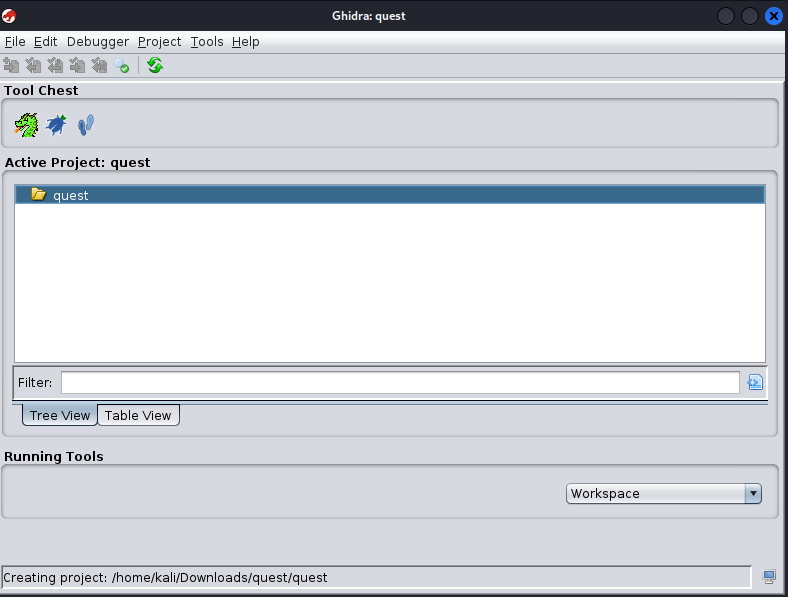
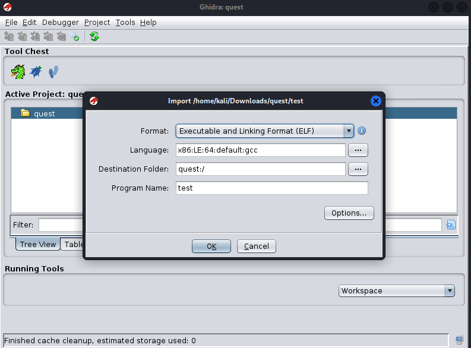
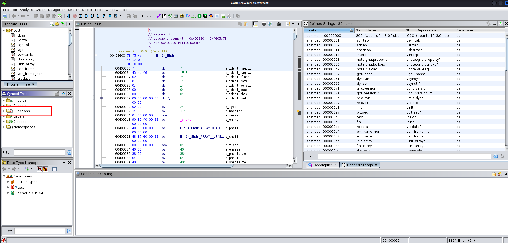
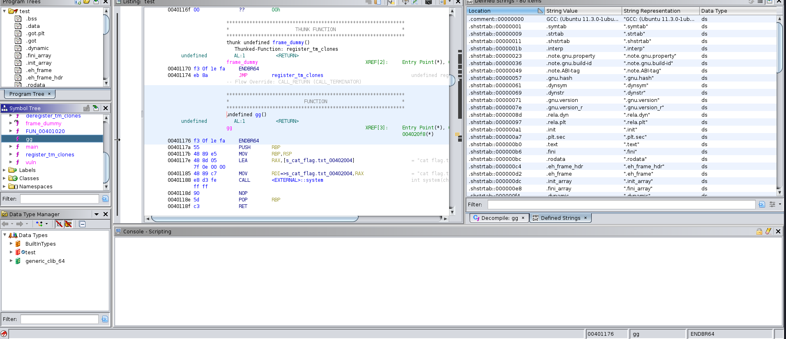
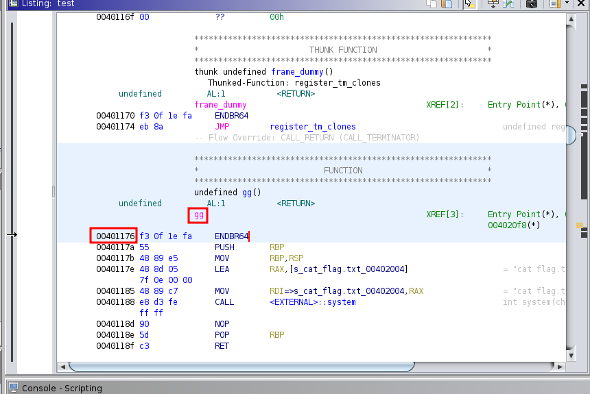

- [Questionnaire](#questionnaire)
  - [Description](#description)
  - [Files](#files)
- [Instructions](#instructions)
  - [Examining the files](#examining-the-files)
- [Step-by-step](#step-by-step)
  - [Questions 1-3](#questions-1-3)
  - [Question 4](#question-4)
    - [gdb](#gdb)
    - [checksec](#checksec)
    - [readelf](#readelf)
  - [Questions 5-8](#questions-5-8)
  - [Question 9](#question-9)
    - [gdb](#gdb-1)
    - [Manual](#manual)
    - [python](#python)
  - [Question 10](#question-10)
    - [gdb](#gdb-2)
    - [objdump](#objdump)
    - [readelf](#readelf-1)
    - [Ghidra](#ghidra)
- [Flag](#flag)
  - [Issues encountered](#issues-encountered)
- [Lessons Learned](#lessons-learned)
- [References](#references)
  - [Additional resources](#additional-resources)


# Questionnaire

Questionnaire is rated as Very Easy under the pwn section of Cyber Apocalypse 2023 (CA23).

## Description

> It's time to learn some things about binaries and basic c. Connect to a remote server and answer some questions to get the flag.

We're given a docker container to spawn, and a `.zip` to download.

The `.zip` contains two files:
* `test.c`
* `test`

## Files

[Questionnaire.zip](/Pwn/Questionnaire/Questionnaire.zip)


# Instructions

First, you will need to unzip the file

```
$ unzip Questionnaire.zip
```

This will extract both test files to our current directory. We can examine both these files using the command `file` with the wildcard `*`. This will show information for all files in this directory.

```
$ file test*
test:   ELF 64-bit LSB executable, x86-64, version 1 (SYSV), dynamically linked, interpreter /lib64/ld-linux-x86-64.so.2, BuildID[sha1]=5a83587fbda6ad7b1aeee2d59f027a882bf2a429, for GNU/Linux 3.2.0, not stripped
test.c: C source, ASCII text
```

## Examining the files

`test` is a simple compiled c file. There's nothing of note to point out for this challenge.

Opening `test.c` with a text editor like `vim` or `gedit` will uncover an important comment within the code

```
$ vim test.c

[snip]

This is not the challenge, just a template to answer the questions.
To get the flag, answer the questions. 
here is no bug in the questionnaire.

[snip]
```

# Step-by-step

Now that we have an idea of what files we'll be working with, let's establish a connection with the docker container.

`nc` to the IP address and port provided by HackTheBox (HTB).

```
$ nc 123.456.789.012 1337
```

This will return a display listing information describing how to examine file information, followed by a prompt at the bottom where we will be asked a series of questions about `test`.

## Questions 1-3

Questions 1-3 can be answered using `file`.


## Question 4

To find the protections enabled on `test` there are several methods you can use:

### gdb

The first method we can use is a powerful program called [gdb](https://en.wikipedia.org/wiki/GNU_Debugger) (GNU Debugger).

> Note: In order to use gdb effectively for this purpose, you will need to have installed [pwntools](https://docs.pwntools.com/en/stable/commandline.html). More about pwntools can be found [here](https://docs.pwntools.com/en/stable/).

```
$ gdb test
$ checksec
```

### checksec

If you do not wish to run gdb, you can run checksec directly

```
$ checksec test
```

OR
```
$ checksec --file=test
```

The only notable difference between each method is wether the information should be displayed in a "top-to-bottom" layout, or a "left-to-right" layout.

### readelf

[One writeup](https://docs404.com/hack-the-box-ca-2023/pwn-questionaire/) suggests using `readelf` to determine file protections. 

```
$ readelf -a test
```

> Note: From a noobie perspective, it's hard to tell what exactly is being done to determine how file permissions are being checked using this method.

## Questions 5-8

Each of these can be answered by examining `test.c`


## Question 9

Question 9 asks how many bytes of input have to be input for a segmentation fault for to occur. There are a few methods that can be performed to solve this.

### gdb

> Note: If you used `gdb` for Question 4, this option makes the most sense to go with. More information of this method can be found [here](https://youtu.be/Mz4ifmzsQiM?list=PLUrAjkLbvTpKBgf4uRsc2JWhs8OZeswah&t=174).

```
$ pattern create 100
$ r <<< $(echo 'Random100CharPatternHere')
$ pattern search "A)AAEAAa"
```

The segmentation fault occurs at `RSP` -> `Offset 40`

### Manual

A simple but time consuming, is trial and error

```
$ gdb test
$ run
AAAAAAAAAAAAAAAAAAAAAAAAAAAAAA
$ gdb test
$ run
AAAAAAAAAAAAAAAAAAAAAAAAAAAAAAAAAAAAAAA
$ gdb test
$ run
AAAAAAAAAAAAAAAAAAAAAAAAAAAAAAAAAAAAAAAA
```

### python

A slightly faster method is with some basic python.

```
$ python3 -c "print('A' * 30)" | ./test
$ python3 -c "print('A' * 39)" | ./test
$ python3 -c "print('A' * 40)" | ./test
```

## Question 10

Question 10 is the hardest of all of the questions asked in this challenge. The information we need to provide is the address of function `gg`. Luckily, we have several ways to find the answer

### gdb

The easiet solution is to use `gdb`.

```
$ p gg
```

This returns

```
$1 = {<text variable, no debug info>} 0x401176 \<gg>
```

### objdump

`objdump -D -F test | grep gg`

This will return:

> **0000000000401176** \<gg> (File Offset: 0x1176):

Which can then be shortened to 0x401176.

### readelf

An interesting alternative posted [here](https://4trxia.github.io/posts/Hackthebox-ctf-2023/#questionnaire-pwn-very-easy) suggests using `readelf`.

`readelf -a test`

I've modified the command slightly to make it a bit easier to find:

`readelf -a test | grep gg`

Which returns the following

> 25: **0000000000401176**    26 FUNC    GLOBAL DEFAULT   15 gg

Which can then be shortened to 0x401176.

### Ghidra

Finally, the long, slow, and stupid method that I used was through Ghidra.

> Note: Seriously, although this does return the correct answer, it involves more clicking and takes time to setup. I'm including this for completeness sake, but the other methods are far quicker and generally more intuitive.

I preferred to use Ghidra primarily because I have not worked with the other methods covered above.

```
$ ghidra
```

You will be met with a few prompts, requiring you to:

1. Create a project
2. Import a file





After creating your project and importing the relevant file, the easiest way to find gg is in the `Fuctions` folder.

Under `System Tree`, select `gg`.





After selecting `gg`, will autonavigate to that area. Ghidra correctly labels this as the gg function, and will include several lines of text. The text `00401176` is what we're looking for!



This was an issue for me, because as a noobie to Ghidra, it wasn't obvious to me that `00401176` was the address for `gg` that I was looking for. I did know enough about [hex](https://simple.wikipedia.org/wiki/Hexadecimal) that, if it had leading zeros, [they should be stripped](https://stackoverflow.com/questions/2670639/why-are-hexadecimal-numbers-prefixed-with-0x) to 0x. I.e. `0x401176`!

# Flag

HTB{th30ry_bef0r3_4cti0n}

## Issues encountered

For the question

> What is the address of gg() in hex? (e.g. 0x401337)

I struggled to find this in `Ghidra`. I hadn't used Ghidra before, so I tried to use ChatGPT help instruct on where to find the information requested. ChatGPT made things **worse**, because it was making up functions and options that do not exist! I strongly discourage the use of ChatGPT for this purpose

By comparison, the YouTuber did a pretty simple solution, without using Ghidra at all:
* `gdb`
* `disass gg`
* The top result, (minus leading 0's)
  * `0x401176`

# Lessons Learned

1. Do not use ChatGPT to write instructions of how to use software.
2. I need to get familiar with `gdb`.
3. I need to install `gef`.
4. I need to learn about `readelf`
5. I need to learn about `objdump`

# References

In no particular order

* https://fazect.github.io/htb2023/#questionnaire
* https://4trxia.github.io/posts/Hackthebox-ctf-2023/#questionnaire-pwn-very-easy
* https://github.com/Mymaqn/HTBCA2023_Pwn_Writeups/tree/master/questionnaire
* https://ilter.tech/blog/htb-pwn-questionnaire/
* https://github.com/D13David/ctf-writeups/tree/main/cyber_apocalypse23/pwn/questionnaire
* https://gitlab.com/Cryptopone/cyberapocalypse2023-writeups/-/tree/main/Pwn/Questionnaire
* https://github.com/LazyTitan33/CTF-Writeups/blob/main/HTB%20-%20CyberApocalypse_2023/Pwn/Questionnaire.md
* https://www.youtube.com/watch?v=Mz4ifmzsQiM&list=PLUrAjkLbvTpKBgf4uRsc2JWhs8OZeswah&index=12
* https://github.com/Fra-SM/CyberApocalypse2023_CTF_Writeups/blob/main/Pwn/Questionnaire.md
* https://docs404.com/hack-the-box-ca-2023/pwn-questionaire/
* https://github.com/sbencoding/htb_ca2023_writeups/blob/master/pwn/questionnaire.md
* https://siunam321.github.io/ctf/Cyber-Apocalypse-2023/Pwn/Questionnaire/
* https://twc1rcle.com/ctf/team/ctf_writeups/cyber_apocalypse_2023/#questionnaire
* https://medium.com/@damaidec/cyber-apocalypse-2023-writeup-308ef9a94828
  * Section is about half way down

## Additional resources

* Info about `pwntools`

https://docs.pwntools.com/en/stable/

* How to install `gef`

https://hugsy.github.io/gef/#quick-start

* How to use `gef`

This isn't a particularly great presentation, but serves as a reasonable introduction to `gef`, which I have no previous familiarity with.

https://www.youtube.com/watch?v=KWG7prhH-ks&list=PLjAuO31Rg972WeMvdR_57Qu-aVM8T6DkQ

* What is hex in simple terms?

https://simple.wikipedia.org/wiki/Hexadecimal

* Why should leading zeros in hex be shortened to 0x?

https://stackoverflow.com/questions/2670639/why-are-hexadecimal-numbers-prefixed-with-0x